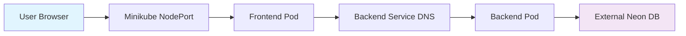

# Implementation Plan: Phase 4: Local Kubernetes Deployment

**Branch**: `001-k8s-deployment` | **Date**: 2026-02-05 | **Spec**: [link](./spec.md)
**Input**: Feature specification from `/specs/001-k8s-deployment/spec.md`

**Note**: This template is filled in by the `/sp.plan` command. See `.specify/templates/commands/plan.md` for the execution workflow.

## Summary

Implementation of Phase 4: Local Kubernetes Deployment focusing on containerizing Next.js frontend and FastAPI backend applications, deploying them to a local Minikube cluster using Helm charts, and configuring proper service communication between components. The plan emphasizes multi-stage Docker builds for optimization, proper Kubernetes resource configuration, and integration with external Neon PostgreSQL database service.

## Technical Context

**Language/Version**: Python 3.12 (backend), JavaScript/TypeScript (frontend with Next.js 16), Dockerfile
**Primary Dependencies**: FastAPI, SQLModel, Next.js, Docker, Kubernetes, Helm, Minikube
**Storage**: External Neon Serverless PostgreSQL database accessed via internet connectivity
**Testing**: Manual verification of container builds, pod health, service connectivity, and Helm chart operations
**Target Platform**: Local Minikube cluster running on Linux/WSL2 environment
**Project Type**: Web application (frontend + backend)
**Performance Goals**: Efficient container builds under 500MB each, deployment within 10 minutes, healthy pod status maintenance
**Constraints**: All work confined to `phase4/` directory, preserve existing frontend/backend logic, use external Neon database
**Scale/Scope**: Single instance deployments for local testing, 1 replica for local Minikube

## Constitution Check

*GATE: Must pass before Phase 0 research. Re-check after Phase 1 design.*

- ✅ Spec-driven development approach followed (spec already created)
- ✅ No manual coding - containerization and deployment configuration via AI assistance
- ✅ Cloud-native principles implemented via containerization and orchestration
- ✅ Architecture follows constitution requirements for Phase IV
- ✅ Technology stack aligns with constitution (Docker, Kubernetes, Helm, Minikube)

## Project Structure

### Documentation (this feature)

```text
specs/001-k8s-deployment/
├── plan.md              # This file (/sp.plan command output)
├── research.md          # Phase 0 output (/sp.plan command)
├── data-model.md        # Phase 1 output (/sp.plan command)
├── quickstart.md        # Phase 1 output (/sp.plan command)
├── contracts/           # Phase 1 output (/sp.plan command)
└── tasks.md             # Phase 2 output (/sp.tasks command - NOT created by /sp.plan)
```

### Source Code (repository root)

```text
phase4/
├── backend/
│   ├── main.py
│   ├── Dockerfile                # Generated for FastAPI backend
│   ├── requirements.txt
│   └── ...
├── frontend/
│   ├── app/
│   ├── package.json
│   ├── Dockerfile               # Generated for Next.js frontend
│   └── ...
├── k8s/
│   └── todo-app/               # Helm chart structure
│       ├── Chart.yaml
│       ├── values.yaml
│       └── templates/
│           ├── backend-deployment.yaml
│           ├── backend-service.yaml
│           ├── frontend-deployment.yaml
│           ├── frontend-service.yaml
│           └── secrets.yaml
└── specs/
    └── 001-k8s-deployment/
        ├── spec.md
        └── plan.md
```

**Structure Decision**: Selected web application structure with separate frontend and backend, maintaining existing codebase while adding containerization and orchestration artifacts in appropriate directories.

## Architecture Overview

### Containerization Strategy
- **Backend (FastAPI)**: Multi-stage Docker build using `python:3.12-slim` base image
- **Frontend (Next.js)**: Multi-stage Docker build leveraging Next.js `output: 'standalone'` feature
- **AI Ops**: Utilize Docker AI (Gordon) to generate optimized Dockerfiles

### Orchestration Strategy (Kubernetes/Minikube)
- **Deployments**: Configured with 1 replica for local testing, CPU/RAM limits, and liveness probes
- **Services**:
  - `backend-svc`: ClusterIP service allowing internal communication
  - `frontend-svc`: NodePort service for external access from browser
- **Configuration**:
  - Secrets: `DATABASE_URL`, `COHERE_API_KEY`, `BETTER_AUTH_SECRET`
  - ConfigMaps: `NEXT_PUBLIC_API_URL` and other non-sensitive configs

### Helm Chart Structure
- Unified Helm chart named `todo-app` in `phase4/k8s/todo-app/`
- Template files for all Kubernetes resources with configurable values
- AI Ops: Use `kubectl-ai` to generate initial manifest files

### Data Flow Diagram (Mermaid)


### Networking Flow
`User Browser` -> `Minikube IP:NodePort` -> `Frontend Pod` -> `Backend Service (DNS)` -> `Backend Pod` -> `External Neon DB (Internet)`

## Implementation Approach

### Phase 0: Research & Analysis
- Research optimal Docker multi-stage build patterns for Next.js and FastAPI
- Analyze best practices for Kubernetes resource configuration (requests/limits)
- Investigate Helm chart best practices for web application deployments

### Phase 1: Design & Contract Generation
- Define Kubernetes resource specifications for deployments and services
- Generate API contracts for containerized services
- Design secret and config management strategy

### Phase 2: Task Generation
- Break down implementation into atomic, testable tasks
- Create tasks for Dockerfile generation, Kubernetes manifests, and Helm charts

## Complexity Tracking

> **Fill ONLY if Constitution Check has violations that must be justified**

| Violation | Why Needed | Simpler Alternative Rejected Because |
|-----------|------------|-------------------------------------|
| External DB dependency | Neon PostgreSQL used for consistency with existing architecture | Would require major rework of existing database schemas and connections |